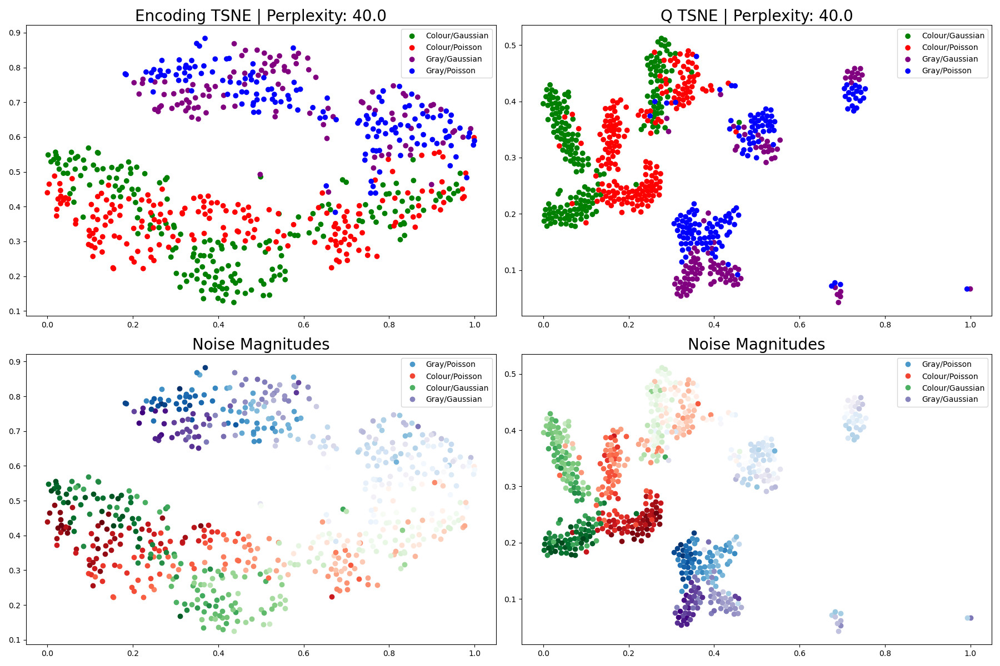

Contrastive Model Evaluation
============================
To evaluate the degradation prediction separation capability of contrastive models, dimensionality reduction techniques are often employed.  These represent the high-dimensional image encodings in 2D graphs, and can provide valuable insight into the model's training status.

For quick evaluation of contrastive models, we have constructed the ```ContrastiveEval``` class, which takes care of:
- Model instantiation and checkpoint loading.
- Data and metadata loading and interpretation.
- Generation of encoded output using provided model.
- Dimensionality reduction of encoded outputs.
- Results display, comparison and exporting.

The class can be quickly setup to evaluate any given contrastive model as follows:

```python
from rumpy.regression.evaluation.eval_hub import ContrastiveEval

hub = ContrastiveEval()  # instantiate main class
dtype = 'noise_compression'  # specify which degradations are available

hub.define_model('path_to_model_folder', 'supmoco_full_stack',
                 2000)  # define model using the model folder, model name and epoch checkpoint

hub.register_dataset('temp_images/mixed_noise_compression', register_hyperparams=True) # define and register data to evaluate

hub.generate_data_encoding(run_umap=False, normalize_fit=True, max_images=None)  # Generate model encoding from data.  By default uses TSNE, but UMAP is also available.
hub.initialize_output_folder('/Users/matt/Desktop')  # initialize output results folder

hub.plot_no_labels()  # plots model encoding with no additional labelling

if 'noise' in dtype:
    hub.plot_noise(plot_magnitudes=True)  # plots data with noise labelling and colouring

if 'compression' in dtype:
    hub.plot_compression()  # plots data with compression labelling and colouring

if 'blur' in dtype:
    hub.plot_blur()  # plots data with blur kernel labelling and colouring
```

An example output for evaluating the results of a noise encoding model is provided below:



For full documentation of the class' capabilities and further examples, please consult the source code at ```rumpy/regression/evaluation/eval_hub.py```.
