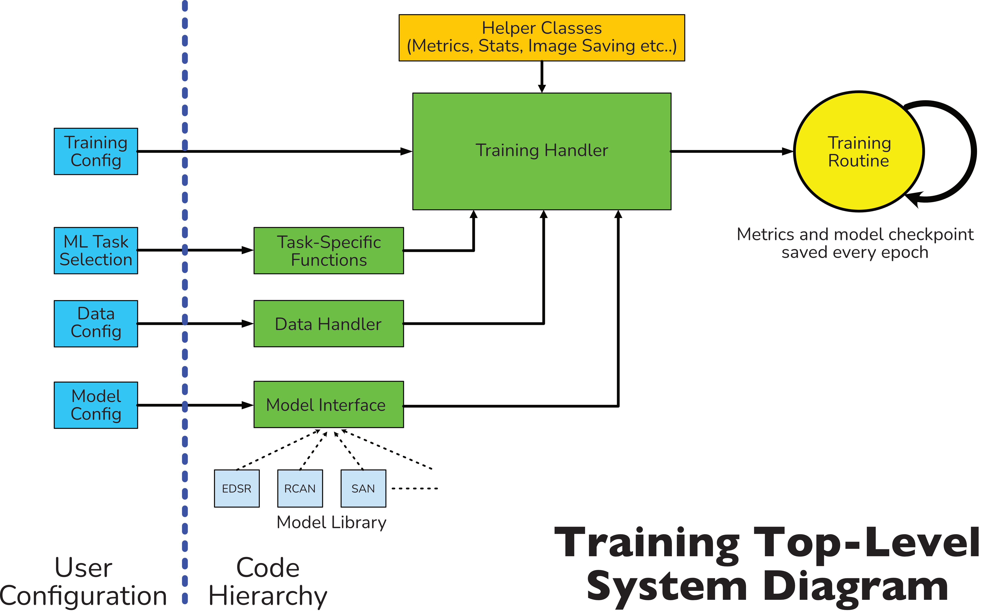

Framework Development
================

RUMpy has been designed to be modular, to allow for easy modification and prototyping.  Prospective developers will need to become familiar with the codebase via direct experimentation, but a top-level view of the package and a number of common development tasks are outlined in this file.

## General System Setup

The general training system is set up as shown in the below image.


- The user specifies training, data and model configuration options via a single .toml config file (examples in ```sample_config_files```).
- The user should also define the model's task (regression, SISR or MISR), which will affect which training handler shall be selected for the model.
- Each of the three sets of configurations get passed to the relevant modules within the selected training handler.
  - The data configuration options can be analyzed in full in `rumpy/shared_framework/training/data_setup.py` and `rumpy/sr_tools/data_handler.py` (this contains the main class for manipulating data).
  - Training config options involve epoch count, early stopping, metric tracking etc, and can be explored in full in `rumpy/shared_framework/training/training_handler.py`.
  - The base model class can be found in `rumpy/shared_framework/models/base_architecture.py`.  However, each individual model has its own set of configuration options, and these should be explored in the relevant model's handler and architecture classes (all models available detailed in the next section).  Additionally, models also have a high-level ImageModelInterface class (`rumpy/shared_framework/models/base_interface.py`), which automates most of the necessary model handling processes.
- Training handlers also uses a variety of functions from sr_tools such as metric calculations, statistics saving etc.
- Once all setup is complete, the provided config file is copied over to the model result folder, and the training routine starts.  This is a repeated loop of training/testing, running through the entire provided dataset.

## Adding a new custom model

Adding a new model involves just a few basic steps:
1. Decide on a lowercase symbolic name for your new model (e.g. **basicnet**).
2. Define the task of this model (one of regression/SISR/MISR).
3. Create a new folder in ```rumpy/*task_name*/models``` to house your new model.  There are no restrictions on the name of this folder (other than it should be unique).
4. Initialize this folder by adding a blank ```__init__.py``` file.
5. Create a python file in this folder called ```handlers.py```.
6. Specify a class in this folder called ```*ModelName*Handler```.  This model should inherit from ```BaseModel``` (```from rumpy.shared_framework.models.base_architecture import BaseModel```).<br>
   E.g: For model 'basicnet', the handler should be called ```BasicNetHandler(BaseModel)```.
7. This class should call the BaseModel initialization script, define the model's architecture and handle any additional setup necessary.  The following is how this is taken care of for EDSR, a standard SISR model:
```python
from .architectures import EDSR
from rumpy.shared_framework.models.base_architecture import BaseModel

class EDSRHandler(BaseModel):
    def __init__(self, device, model_save_dir, eval_mode=False, lr=1e-4, scale=4, in_features=3, hr_data_loc=None,
                 scheduler=None, scheduler_params=None, perceptual=None,
                 num_features=64, num_blocks=16, res_scale=0.1, **kwargs):
        super(EDSRHandler, self).__init__(device=device, model_save_dir=model_save_dir, eval_mode=eval_mode,
                                          hr_data_loc=hr_data_loc, **kwargs)  # calling the BaseModel standard initialization protocol
        self.net = EDSR(scale=scale, in_features=in_features, net_features=num_features, num_blocks=num_blocks,
                        res_scale=res_scale) # initialization of model architecture
        self.colorspace = 'rgb'  # EDSR takes in RGB images directly
        self.im_input = 'unmodified'  # the input image is not modified before use
        self.activate_device()  # standard function to send model to GPU if in use
        self.training_setup(lr, scheduler, scheduler_params, perceptual, device)  # prepares schedulers and optimizers

        self.model_name = 'edsr'  # model name
```
7. To make any changes to the training/eval routine, override ```run_train```, ```run_eval``` or ```run_model``` from the BaseModel.
8. Meta-Models can be easily setup by inheriting from QModel instead (```from SISR.models.attention_manipulators import QModel```)
9. Attributes from other defined models can also be inherited to simplify development (all models available defined below).

Examples of models set up with this method can be found in the ```rumpy/SISR/models``` folder, EDSR (under ```advanced```) is one of the easier models to start off with, while QRCAN (under ```attention_manipulators```) contains an example of a standard meta-attention upgraded network.
## Implemented Model Locations and Placement

Models have been split up into folders according to their category.  The specific models available for each task are provided below.
### SISR
- basic **NOTE: These models require images to be pre-upsampled before inserting into model.**
  - SRCNN
  - VDSR
- advanced
  - EDSR
  - RCAN
  - HAN
  - SAN
  - EDSRMD - this is an implementation of EDSR with the capability for inserting metadata as extra channels, akin to SRMD.
  - SRMD
  - ELAN
- attention_manipulators (models upgraded with meta-attention)
  - Q-EDSR
  - Q-RCAN
  - Q-HAN
  - Q-SAN
  - Metabed
    - This model consists of a truncated EDSR modified to allow insertion of different meta-layers.
  - Q-RealESRGAN
  - Q-ELAN
- non_blind_gan_models
  - ESRGAN
  - Real-ESRGAN
  - BSRGAN
- blur_kernel_blind_sr
  - IKC
    - Note: This is a multi-model.
  - DAN_v1
  - DAN_v2
  - DASR
    - Note: First few epochs are dedicated to solely pre-training encoder.
  - DAN conjugated with RCAN, HAN, ELAN or Real-ESRGAN
  - Contrastive encoders conjugated with RCAN, HAN, SAN, ELAN, Real-ESRGAN, EDSR or Metabed.
- implicit_blind_sr
  - Contains an implementation of FSSR, not fully tested.
- DICnets
  - Not confirmed to be working correctly.  Requires further development/scrutiny.
- ensemble_models
  - RCANSplit - This model is intended to train multiple sub-models for specific data splits.  Currently only works with CelebA.
- feature_extractors
  - Contains various methods for calculating perceptual loss using VGG networks.
- SFTMD_variants
  - This contains the basic SFTMD, but this has also been modified to accept a variety of different meta-layers.
- SPARNet
  - Contains both SPARNet and q-SPARNet.
  - Note, images must be first pre-upsampled before inserting into models.
- swinIR
  - Contains beginning of implementation of transformer model.  Still untested.
- waveletnets
  - Contains both WaveletSRNet and an implementation of WaveletSRGAN.
  - WaveletSRGAN has not been confirmed to function correctly, will require further development.
- face_attributes_gan_models (models that expect a list of features as an input (e.g., blonde hair, bushy eyebrows, etc.), together with the LR image)
  - FaceSR-Attributes-GAN (original implementation was in Lua, the model runs but does not produce the input-based editing shown in the paper)
  - AGA-GAN (model runs but could not produce the output from the paper)
  - FMFNet (idea to fuse encoded features from face metadata and features from the image, requires further development)
- generative_face_models
  - FaceGAN (test for a simple generative GAN, did not produce good results)

**All models which include the insertion of image metadata inherit from QModel (SISR/models/attention_manipulators/\_\_init\_\_.py), which contains all the necessary functionality for preparing metadata for insertion into models.**

### Regression/Classification/Contrastive Prediction

- standard_classifier_models
  - Resnet
  - Densenet
  - Efficientnet (requires PyTorch 0.11)
- MANet (still requires further testing)
- Contrastive Models
  - MoCo
  - SupMoCo
  - WeakCon
  - SupCon
All models which contain multiple sub-networks inherit from MultiModel (models/\_\_init\_\_.py) which contains all the necessary functionality to save/load/utilize sub-models.
